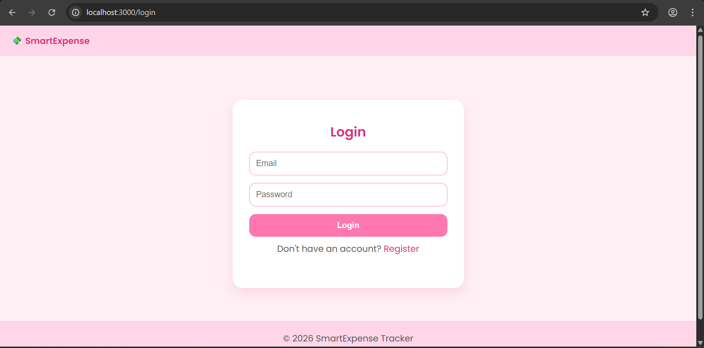
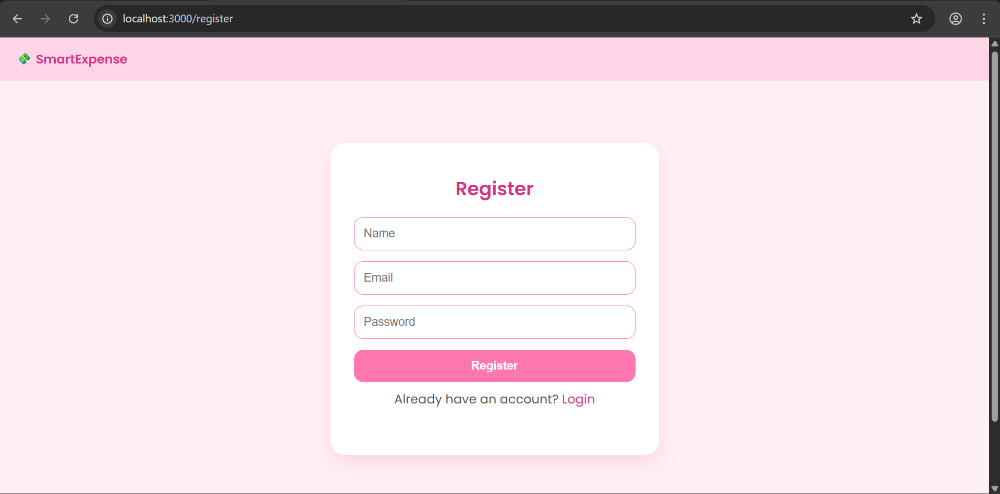
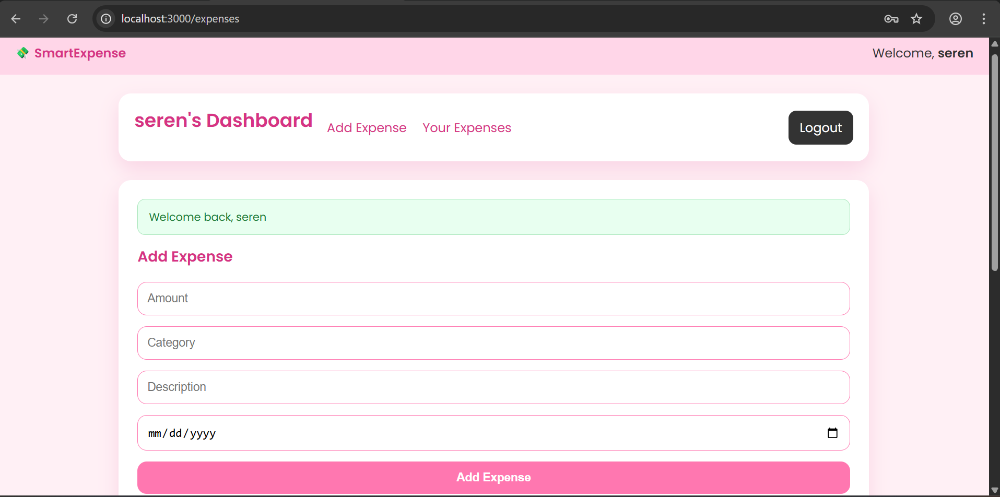
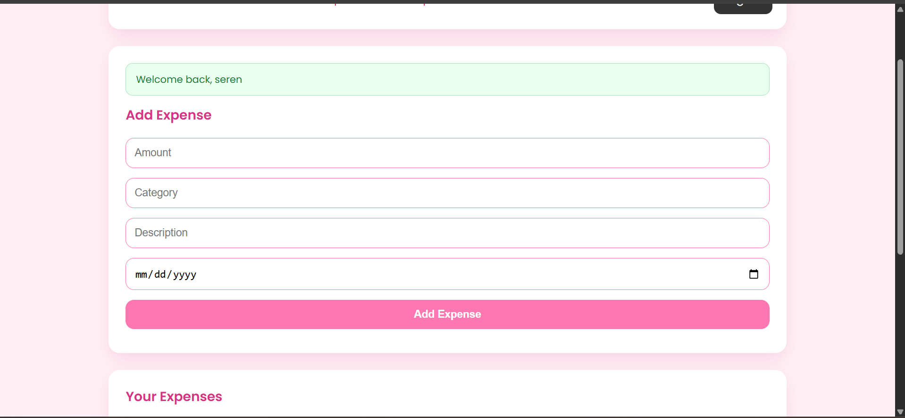
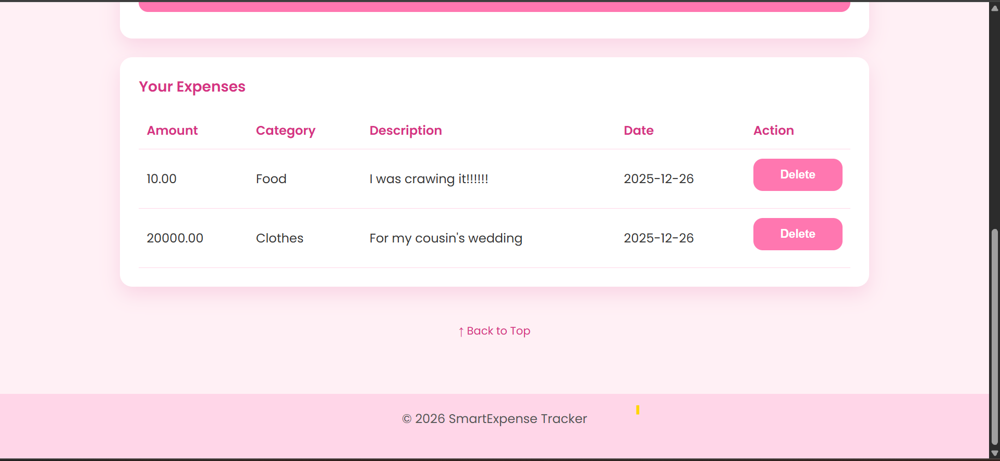

# SmartExpense Tracker 💸
A full‑stack expense tracker web app built with Node.js, Express, MySQL, and EJS.

## Features
- User registration and login
- Dashboard to add, list, and delete expenses
- Responsive EJS templates with custom CSS
- Session-based authentication

## Installation
1. Clone the repo: `git clone https://github.com/Its-seren/SmartExpense.git`
2. Install dependencies: `npm install`
3. Configure `.env` with DB credentials
4. Start the server: `node app.js`

## Screenshots

### Login Page

### Registration Page

### Dashboard

### Add Expense Form

### Expense List

### Mobile View
